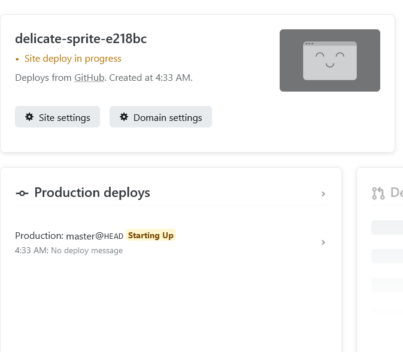

# Get A Pro Mobile Demo

Demo de l'application Mobile Get a pro.

## Deploiement

L'ojectif est de déployer le build du projet sur Netlify afin qu'il soit accessible en ligne.  

1. Créer un répository sur github
2. Cloner le répo en local
3. Faire un build du projet ionic en faisant `ionic build`. Un dossier `www` sera créé dans la racine du projet.
4. Copier le dossier `www` dans le dossier du répo
5. Faire un ``push`` du répo
6. Se connecter sur netlify avec votre compte github
   
7. Aller sur `Add a new Site` puis sur `Import an existing project from a Git repository`
   
8. Vous choisissez github puis le répo que vous avez créé sur la liste
   
   
9.  Dans la configuration de déploiement :
   1.  vous mettez `/www` pour `Base directory`
   2.  vous laissez `Base directory` et `Publish directory` vides
   3.  Appuyez sur `Deploy site`
    
1.  Normalement votre site sera déployé avec succès il faut juste cliquer sur le lien.

Le site sera ensuite disponible en ligne.

